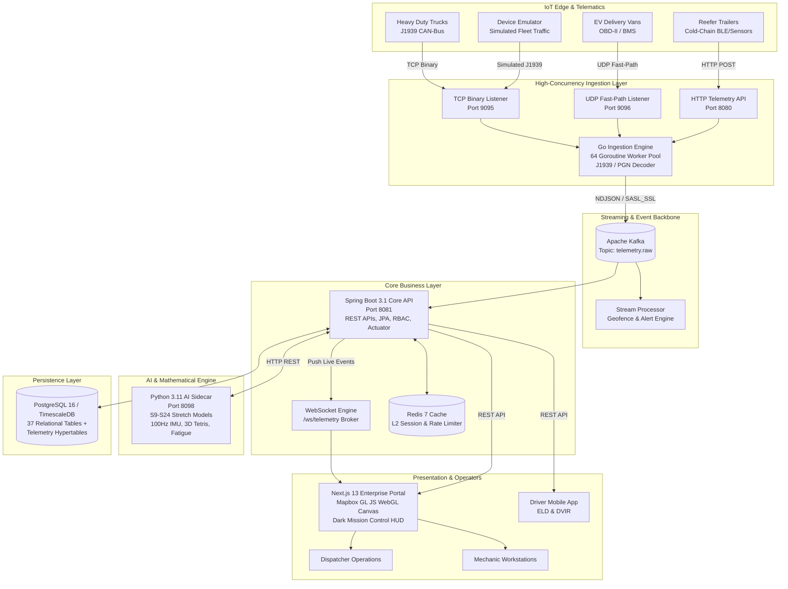

# FleetCore Enterprise — Global Real-Time IoT & Fleet Management Platform

[](https://github.com/abdulwasay4585/FleetCore-Enterprise/actions)
[](https://nextjs.org/)
[](https://spring.io/projects/spring-boot)
[](https://golang.org/)
[](https://www.python.org/)
[](https://www.postgresql.org/)
[](https://redis.io/)
[](https://kafka.apache.org/)

FleetCore Enterprise is a distributed, high-concurrency IoT telemetry and fleet intelligence platform engineered for global logistics conglomerates, heavy construction operators, cold-chain distribution networks, and electric vehicle (EV) commercial fleets.

The platform ingests millions of telemetry events per second over binary TCP/UDP protocols, streams them through an event-driven Kafka message bus, executes real-time diagnostics and predictive maintenance models, and delivers sub-second telemetry streams to an operations command center via WebSockets and WebGL geospatial rendering.

---

## 🏗️ System Architecture

FleetCore Enterprise follows an event-driven, decoupled microservices architecture designed for zero single point of failure (SPOF) and sub-second end-to-end telemetry propagation:



### 📦 End-to-End System Block Diagram

```text
┌──────────────────────────────────────────────────────────────────────────────────────────────────┐
│                                       FLEETCORE ENTERPRISE                                       │
│                                  SYSTEM ARCHITECTURE BLUEPRINT                                   │
└──────────────────────────────────────────────────────────────────────────────────────────────────┘

┌──────────────────────────────────────────────────────────────────────────────────────────────────┐
│ 1. EDGE TELEMATICS & VEHICLE IOT LAYER                                                           │
│  ┌───────────────────────┐   ┌────────────────────────┐   ┌───────────────────────────────────┐  │
│  │ Heavy Trucks (J1939)  │   │ EV Cargo Vans (BMS)    │   │ Reefer Trailers (Cold-Chain BLE)  │  │
│  │ • PGN 61444 (RPM)     │   │ • Battery SoC / SoH    │   │ • Ambient Temp (-30°C to +20°C)   │  │
│  │ • PGN 65265 (Speed)   │   │ • Charging State / kWh │   │ • Door Open/Close Proximity       │  │
│  │ • 18-Wheel TPMS (PSI) │   │ • Regenerative Brake   │   │ • Reefer Engine Fault Codes       │  │
│  └───────────┬───────────┘   └───────────┬────────────┘   └─────────────────┬─────────────────┘  │
└──────────────┼───────────────────────────┼──────────────────────────────────┼────────────────────┘
               │ (TCP Binary Port 9095)    │ (UDP Fast-Path Port 9096)        │ (HTTP POST Port 8080)
               ▼                           ▼                                  ▼
┌──────────────────────────────────────────────────────────────────────────────────────────────────┐
│ 2. HIGH-CONCURRENCY INGESTION LAYER (Go 1.21+)                                                   │
│  ┌────────────────────────────────────────────────────────────────────────────────────────────┐  │
│  │  Go Ingestion Engine [64 Worker Goroutines Pool]                                           │  │
│  │  • J1939 Bit-Level PGN/SPN Decoder       • Fast-Path UDP Buffer Pool                       │  │
│  │  • Microsecond Packet Deserialization    • Zero-Alloc Network Buffer Streaming             │  │
│  └─────────────────────────────────────────────┬──────────────────────────────────────────────┘  │
└────────────────────────────────────────────────┼─────────────────────────────────────────────────┘
                                                 │ (NDJSON Event Stream over SASL_SSL)
                                                 ▼
┌──────────────────────────────────────────────────────────────────────────────────────────────────┐
│ 3. DISTRIBUTED STREAMING BACKBONE & COMPLEX EVENT PROCESSING                                     │
│  ┌─────────────────────────────────────────┐   ┌──────────────────────────────────────────────┐  │
│  │ Apache Kafka Event Bus                  │   │ Apache Flink Stream Processor                │  │
│  │ • Topic: telemetry.raw (Partitioned)    │───│ • Sub-second Geofence Crossings (PostGIS)    │  │
│  │ • Partition Key: asset_id               │   │ • Severe DTC Anomaly Triggers & Alerts       │  │
│  └────────────────────┬────────────────────┘   └──────────────────────────────────────────────┘  │
└───────────────────────┼──────────────────────────────────────────────────────────────────────────┘
                        │
                        ▼
┌──────────────────────────────────────────────────────────────────────────────────────────────────┐
│ 4. CORE ENTERPRISE BUSINESS LAYER & CACHE (Spring Boot 3.1 / Java 17 + Redis 7)                  │
│  ┌─────────────────────────────────────────────────────┐   ┌──────────────────────────────────┐  │
│  │ Spring Boot 3.1 Core Services                       │   │ Redis 7 L2 Distributed Cache     │  │
│  │ • Multi-Tenant RBAC (Global HQ > Region > Depot)    │   │ • Sub-10ms Coordinate Lookups    │  │
│  │ • Commercial Dispatch & Route Optimization          │<──┤ • Rate Limiting & Auth State     │  │
│  │ • Maintenance Planner & Automated DTC Work Orders   │   │ • Active Geofences Registry      │  │
│  │ • FMCSA ELD Compliance & Quarterly IFTA Engine      │   │ • DTC Code Translation Cache     │  │
│  └──────────┬─────────────────────────────┬────────────┘   └──────────────────────────────────┘  │
└─────────────┼─────────────────────────────┼──────────────────────────────────────────────────────┘
              │ (HTTP REST)                 │ (JPA / SSL)
              ▼                             ▼
┌───────────────────────────────┐   ┌──────────────────────────────────────────────────────────────┐
│ 5. AI & MATHEMATICAL SIDECAR  │   │ 6. PERSISTENCE LAYER (PostgreSQL 16 + TimescaleDB)           │
│ (Python 3.11 Engine - Port 8098)  │ • 37 Relational Tables (Tenants, Users, Depots, Assets)      │
│ • S9: 100Hz IMU Collision     │   │ • TimescaleDB Telemetry Hypertables (Sub-second Pings)       │
│ • S13: 3D Cargo Tetris Packing│   │ • Diagnostic Fault Dictionaries (SAE / J1939 Codes)          │
│ • S15: Circadian Fatigue Model│   │ • PostGIS Geospatial Polygon Geofences & Routes              │
│ • S19: Dispatch Voice NLP     │   │ • DVIR Digital Inspection Reports & Parts Catalog            │
│ • S24: AI Safety Coaching Gen │   │ • Audit Trails & Immutable Regulatory Compliance Logs        │
└───────────────────────────────┘   └──────────────────────────────────────────────────────────────┘
              │ (Calculated Analytics)
              ▼
┌──────────────────────────────────────────────────────────────────────────────────────────────────┐
│ 7. MISSION CONTROL PRESENTATION LAYER (Next.js 13 App Router + Mapbox GL JS)                    │
│  ┌────────────────────────────────────────────────┐   ┌───────────────────────────────────────┐  │
│  │ WebGL Geospatial Command Center                │   │ Operational Management Consoles       │  │
│  │ • 10,000+ Marker WebGL Hardware Acceleration   │   │ • Gantt Chart Dispatch Board          │  │
│  │ • Live Dynamic Movement Interpolation          │   │ • 360° Asset Health Telemetry Hub     │  │
│  │ • Sub-second WebSocket Telemetry Pushes        │   │ • FMCSA ELD Driver Hours & Logs       │  │
│  │ • Tactical Dark HUD Visual Hierarchy           │   │ • Predictive Maintenance Work Desk    │  │
│  └────────────────────────────────────────────────┘   └───────────────────────────────────────┘  │
└──────────────────────────────────────────────────────────────────────────────────────────────────┘
```

---

## 🧩 Technology Stack & Component Breakdown

| Layer | Technology | Key Libraries / Frameworks | Responsibilities |
|---|---|---|---|
| **Frontend Web App** | Next.js 13 (App Router), React 18 | Mapbox GL JS, Lucide React, Tailwind CSS | Real-time command center, WebGL asset tracking, dispatch Gantt board, maintenance planner, ELD log viewer. |
| **IoT Ingestion Engine** | Go 1.21+ | Standard Library `net`, `sync/atomic`, `crypto/tls` | High-throughput binary TCP/UDP listener, J1939 CAN frame decoding (PGN/SPN translation), Kafka publishing. |
| **Core Enterprise API** | Java 17, Spring Boot 3.1 | Spring Data JPA, Spring Security, Lettuce, Jackson | Multi-tenant RBAC, asset lifecycle management, route sequencing, work orders, WebSocket telemetry server. |
| **AI & Math Sidecar** | Python 3.11 | FastAPI / Built-in HTTP, NumPy, Math Engine | 100Hz accelerometer collision reconstruction, 3D cargo packing optimization, circadian fatigue modeling, NLP intent parser. |
| **Stream Processing** | Apache Kafka & Flink | Kafka Streams, Flink CEP | Distributed message queuing, sub-second geofence boundary crossing detection, threshold anomaly alerting. |
| **Data Layer** | PostgreSQL 16 + TimescaleDB | PostGIS, standard SQL schema | 37 relational tables for enterprise hierarchies, time-series telemetry hypertables, DTC fault dictionaries. |
| **Caching & State** | Redis 7 | Redis Lettuce Pool, LRU eviction | Distributed rate limiting, session storage, L2 cache for asset positions, fault codes, and IFTA tax rates. |
| **Containerization** | Docker & Docker Compose | Multi-stage Alpine images | Production-grade containerization with non-root execution (UID 1000) and minimal attack surface. |

---

## ⚡ Core Enterprise Modules

### 1. IoT & High-Frequency Telematics Ingestion
- **Protocol Support**: Custom binary TCP/UDP protocols for bandwidth-constrained field hardware, plus HTTP/JSON fallback.
- **J1939 CAN-Bus Parser**: Native bit-level decoding of standard Heavy-Duty SAE J1939 PGNs:
  - `PGN 61444 (EEC1)`: Engine speed (RPM), torque demand.
  - `PGN 65262 (ET1)`: Engine coolant, oil, and intercooler temperatures.
  - `PGN 65265 (CCVS)`: Wheel-based vehicle speed, cruise control status.
  - `PGN 65257 (LFC)`: Fuel consumption rate (L/h) and total fuel used.
- **Worker Pool**: 64 non-blocking concurrent worker goroutines handling packet deserialization and Kafka dispatch.

### 2. Live Command Center & WebGL Map
- **WebGL Rendering**: High-performance Mapbox GL JS map layer capable of rendering tens of thousands of moving markers without UI lag.
- **Dynamic HUD**: Mission-control dark aesthetic with live asset clustering, heading interpolation, speed gauges, and breadcrumb trails.
- **WebSocket Streaming**: Direct push updates over `/ws/telemetry` bypassing HTTP polling overhead.

### 3. Predictive Maintenance & DTC Fault Translation
- **Diagnostic Trouble Code (DTC) Engine**: Instant translation of SAE and J1939 fault codes (e.g., `P0299` Turbo Underboost, `P0300` Random Misfire, `SPN-110` Coolant Temp Overheat).
- **Automated Work Orders**: Generates prioritized maintenance tickets with recommended actions, required parts, and mechanic assignments.
- **Tire Pressure (TPMS) & EV Telematics**: Multi-axle tire pressure monitoring (PSI) and EV battery state-of-health (SoH), state-of-charge (SoC), and charging cycles.

### 4. Dispatch, Commercial Routing & Backhaul Optimization
- **Commercial Vehicle Constraints**: Routes accounting for bridge weight limits, low overpasses, and hazardous material restrictions.
- **Gantt Dispatch Board**: Real-time load assignment, driver dispatching, multi-stop waypoint sequencing, and estimated arrival windows.
- **Empty-Mile Reduction**: Backhaul matching engine identifying return-trip loads for idle vehicles near destination hubs.

### 5. Regulatory Compliance (ELD & IFTA)
- **FMCSA ELD Tracking**: Automated Hours-of-Service (HOS) duty status logging (`Driving`, `On-Duty`, `Off-Duty`, `Sleeper Berth`).
- **IFTA Automated Tax Reporting**: Mileage aggregation cross-referenced by state/provincial boundaries for quarterly fuel tax filings.
- **Driver Safety Scoring**: Algorithmic penalty scoring for harsh braking, rapid acceleration, excessive idling, and overspeeding.

### 6. Phase 6 Stretch AI Engine (25 Advanced Algorithms)
- **S9: 100Hz IMU Collision Reconstruction**: Fast-Fourier transform and jerk analysis for crash severity forensics.
- **S13: 3D Cargo Packing Optimizer**: 3D bin-packing heuristic algorithms maximizing trailer volume and weight distribution.
- **S15: Biometric Circadian Fatigue Predictor**: Circadian rhythm fatigue modeling calculating driver alert levels and mandatory rest stops.
- **S19: NLP Dispatch Voice Assistant**: Speech/text natural language intent classifier for hands-free dispatcher workflows.
- **S24: AI Safety Coaching Synthesizer**: Generates contextual, personalized safety training modules based on driver telemetry violations.

---

## 🗄️ Database Architecture (37 Enterprise Tables)

The persistence layer uses PostgreSQL 16 (compatible with TimescaleDB hypertables) structured into relational modules:

```text
Database Architecture:
├── Multi-Tenancy & Org Hierarchy
│   ├── tenants (Global conglomerates)
│   ├── regions (Geographic operating divisions)
│   ├── depots (Local distribution hubs & yards)
│   ├── roles (Granular permission matrix)
│   └── users (Dispatchers, admins, mechanics)
├── Fleet & Asset Management
│   ├── asset_types (Trucks, reefers, EV vans, forklifts)
│   ├── assets (VIN, specs, EV battery capacity, depot mapping)
│   └── drivers (CDL license, medical certification, safety scores)
├── High-Frequency Telemetry & Diagnostics
│   ├── telemetry (Hypertables: GPS, speed, fuel, EV battery, TPMS)
│   ├── engine_faults (Active & historical DTC fault events)
│   ├── dtc_dictionary (Diagnostic code translations & severities)
│   └── temperature_logs (Cold-chain reefer cargo sensor logs)
├── Routing, Loads & Dispatch
│   ├── routes (Planned routes, distance, duration)
│   ├── stops (Waypoints, geocodes, delivery windows)
│   ├── loads (Freight manifests, cargo weight, hazardous flags)
│   └── geofences (PostGIS polygon coordinates & speed limits)
├── Maintenance & Inventory
│   ├── work_orders (Repair tickets, status, mechanic ID)
│   ├── parts_inventory (Spare parts catalog, stock levels, reorder points)
│   └── dvirs (Pre-trip and post-trip digital vehicle inspection reports)
└── Compliance & Audit
    ├── eld_logs (Hours of Service driver duty records)
    ├── safety_events (Harsh braking, cornering, speeding incidents)
    └── audit_logs (Platform immutable administrative audit trail)
```

---

## 📡 REST API & WebSocket Surface

### Core REST Endpoints

| Method | Endpoint | Description | Auth Required |
|---|---|---|---|
| `POST` | `/api/v1/auth/login` | Authenticate user & issue JWT token | No |
| `GET` | `/api/v1/health` | Comprehensive database & stretch engine health check | No |
| `GET` | `/api/v1/assets/locations` | Retrieve latest coordinates and telemetry for all active assets | Yes |
| `GET` | `/api/v1/assets/{id}` | Detailed 360-degree status of a specific asset | Yes |
| `POST` | `/api/v1/routes/dispatch` | Dispatch an optimized route manifest to a driver | Yes |
| `GET` | `/api/v1/maintenance/work-orders` | List open maintenance tickets and mechanic assignments | Yes |
| `POST` | `/api/v1/maintenance/dtc/lookup` | Lookup diagnostic fault code in dictionary | Yes |
| `GET` | `/api/v1/eld/logs/{driverId}` | Fetch FMCSA Hours-of-Service logs for a driver | Yes |
| `POST` | `/api/v1/stretch/ai/evaluate` | Forward telemetry payload to Python AI engine for evaluation | Yes |

### Real-Time WebSocket Streaming

- **Endpoint**: `/ws/telemetry`
- **Protocol**: STOMP / Raw WebSocket
- **Payload Format**:
```json
{
  "assetId": "TRK-8921",
  "timestamp": "2026-09-25T18:28:40Z",
  "coordinates": { "lat": 41.8781, "lon": -87.6298 },
  "speedKmh": 105.4,
  "heading": 90,
  "engineRpm": 1450,
  "fuelLevelPct": 84.0,
  "batterySocPct": 0,
  "tpmsPressuresPsi": { "FL": 110, "FR": 109, "RL1": 108, "RL2": 110, "RR1": 107, "RR2": 111 },
  "activeDtc": []
}
```

---

## 🚀 Local Development Setup

### Prerequisites
- **Node.js**: v20.x or higher
- **Java JDK**: 17+ (Eclipse Temurin recommended)
- **Apache Maven**: 3.9+
- **Go**: 1.21+
- **Python**: 3.11+
- **Docker & Docker Compose**: v24+

### 1. Clone the Repository
```bash
git clone https://github.com/abdulwasay4585/FleetCore-Enterprise.git
cd FleetCore-Enterprise
```

### 2. Configure Local Environment Variables
Copy the template files:
```bash
cp .env.example .env
cp frontend/.env.example frontend/.env.local
```

Edit `.env` with your local development parameters:
```env
POSTGRES_DB=fleetcore_db
POSTGRES_USER=fleetcore_admin
POSTGRES_PASSWORD=your_secure_local_password
POSTGRES_PORT=5433

REDIS_PORT=6380
KAFKA_PORT=9093

JWT_SECRET=your_minimum_32_character_jwt_signing_key_here
SERVER_PORT=8081
AI_SIDECAR_PORT=8098
```

### 3. Spin Up Infrastructure with Docker Compose
```bash
cd infrastructure
docker compose --env-file ../.env up --build
```

**Local Service Endpoints:**
- **Frontend**: `http://localhost:3000`
- **Core Spring Boot API**: `http://localhost:8081`
- **Go Ingestion Engine**: `http://localhost:8080` (HTTP) / `:9095` (TCP) / `:9096` (UDP)
- **Python AI Sidecar**: `http://localhost:8098`
- **PostgreSQL**: `localhost:5433`
- **Redis**: `localhost:6380`

### 4. Running the Vehicle Emulator
To simulate live truck traffic with J1939 CAN-bus telemetry and feed the map:
```bash
cd emulators
python device_emulator.py --num-vehicles 10 --interval 2.0
```

---

## 🔒 Security Architecture

- **Zero-Trust Network Access**: Backend databases and Redis caches are restricted to private container networks.
- **Cryptographic Token Security**: Stateless authentication powered by HMAC-SHA256 / RSA JWT signatures with configurable expiry.
- **CORS Whitelisting**: Strict origin controls prevent unauthorized cross-site requests.
- **Hardware Authentication**: Field devices utilize mutual TLS (mTLS) certificate verification to guard against GPS spoofing.
- **Container Hardening**: All Docker images execute under non-privileged service users (`USER 1000:1000`) on minimal Alpine Linux bases.

---

## 🧪 Testing & Verification

```bash
# Run Spring Boot Unit & Integration Tests
cd core-api
mvn test

# Run Go Ingestion Engine Tests
cd ../ingestion-server
go test -v ./...

# Validate Python AI Syntax & Sidecar Tests
cd ../emulators
python -m py_compile stretch_ai_math_service.py

# Build Next.js Production Frontend
cd ../frontend
npm run build
```

---

## 📄 License & Attribution

This project is licensed under the MIT License — see the [LICENSE](LICENSE) file for details. Built for enterprise scale, resilient IoT streaming, and mission-critical fleet logistics.
